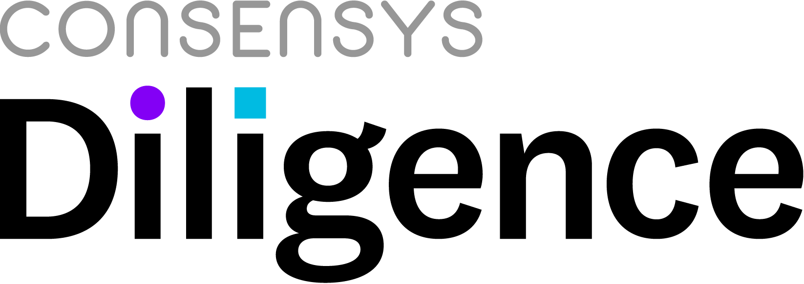

<!-- This file is autogenerated. DO NOT EDIT. -->

# Aragon Payroll Application Audit



* [1 Summary](#1-summary)
* [2 Audit Scope](#2-audit-scope)
  * [2.1 Documentation](#21-documentation)
* [3 System Overview](#3-system-overview)
  * [3.1 Detailed Design](#31-detailed-design)
* [4 Key Observations/Recommendations](#4-key-observationsrecommendations)
* [5 Security Specification](#5-security-specification)
  * [5.1 Actors](#51-actors)
  * [5.2 Trust Model](#52-trust-model)
* [6 Issues](#6-issues)
  * [6.1 PriceFeed is not trustless and can affect the payouts](#61-pricefeed-is-not-trustless-and-can-affect-the-payouts)
  * [6.2 Employee should be able limit exchange rate](#62-employee-should-be-able-limit-exchange-rate)
  * [6.3 Employee may lose up to a second of the salary](#63-employee-may-lose-up-to-a-second-of-the-salary)
  * [6.4 Exchange rate upper limit](#64-exchange-rate-upper-limit)
  * [6.5 Allowed tokens list should be modifiable](#65-allowed-tokens-list-should-be-modifiable)
  * [6.6 Decimal calculations `ONE`, can differ between Price feed and Payroll](#66-decimal-calculations-one-can-differ-between-price-feed-and-payroll)
  * [6.7 Create an external function to view employees balance](#67-create-an-external-function-to-view-employees-balance)
  * [6.8 Payroll - Unused Import `SafeMath8`](#68-payroll---unused-import-safemath8)
  * [6.9 Payroll - Internal role constants can be slightly gas optimized](#69-payroll---internal-role-constants-can-be-slightly-gas-optimized)
* [7 Tool-Based Analysis](#7-tool-based-analysis)
  * [7.1 MythX](#71-mythx)
  * [7.2 Ethlint](#72-ethlint)
  * [7.3 Surya](#73-surya)
* [8 Test Coverage Measurement](#8-test-coverage-measurement)
* [Appendix 1  - Disclosure](#appendix-1----disclosure)


## 1 Summary

ConsenSys Diligence conducted a security audit on a new Aragon app [Payroll](https://github.com/aragon/aragon-apps/tree/master/future-apps/payroll) and [Passive Pricefeed (PPF)](https://github.com/aragon/ppf). These apps are deeply dependent on [aragonOS](https://github.com/aragon/aragonOS) and some other Aragon apps (such as [Finance](https://github.com/aragon/aragon-apps/tree/master/apps/finance)) which are out of the scope for this audit.

* **Project Name:** Payroll Aragon App and PPF Contracts
* **Client Name:** Aragon Association
* **Client Contact:** Louis Giraux (association@aragon.org)
* **Lead Auditor:** Shayan Eskandari
* **Co-auditors:** Daniel Luca, Martin Ortner, Sergii Kravchenko
* **Date:** July 2019


## 2 Audit Scope
This audit covered the following repositories and files:

| Repository     | Frozen Commit hash                             |
|----------------|----------------------------------------|
| [Payroll](https://github.com/aragon/aragon-apps/tree/master/future-apps/payroll)  |        [35a2c25b7e5e22b88fd584a9d2ee023f785e8d4c](https://github.com/aragon/aragon-apps/commit/35a2c25b7e5e22b88fd584a9d2ee023f785e8d4c)                               |
| [Passive Pricefeed (PPF)](https://github.com/aragon/ppf) | [68ab78db525bee218fd62e155cd76c68136abe3f](https://github.com/aragon/ppf/commit/68ab78db525bee218fd62e155cd76c68136abe3f) |


| File           | SHA-1 hash                             |
|----------------|----------------------------------------|
| payroll/future-apps/payroll/contracts/Payroll.sol | e0e6aba06d5c030d56b5026680c643644638ec38 |
| ppf-contracts/packages/ppf-contracts/contracts/PPF.sol | 291a27a38cb5d1605fed855b5e47b8928c157dea |
| ppf-contracts/packages/ppf-contracts/contracts/IFeed.sol | 3a1a6b3e463fcd862b658b2f2c427027c51a2c86 |
| ppf-contracts/packages/ppf-contracts/contracts/IPPFFactory.sol | f16e2e810a00580a472e05d0c95ce0227ac2318e |
| ppf-contracts/packages/ppf-contracts/contracts/PPFFactory.sol | f3689a91643f72ea7d2c33057ddd057c363ca966 |


The following files were used as reference point and were not included in the full audit:

| File           | SHA-1 hash                             |
|----------------|----------------------------------------|
| payroll/future-apps/payroll/contracts/PayrollKit.sol | 6637ffaead511c8121bce29534a2f867c2efdca7 |

### 2.1 Documentation 

The following documentation was available to the audit team:

* [aragonOS 4 reference documentation](https://hack.aragon.org/docs/aragonos-ref)
* [aragon developer portal](https://hack.aragon.org/)
* [Passive Pricefeed (PPF) README](https://github.com/aragon/ppf/blob/master/readme.md)
* [Payroll README](https://github.com/aragon/aragon-apps/blob/master/future-apps/payroll/README.md)
* [Updated Payroll README](https://github.com/aragon/aragon-apps/blob/ff79b8b9fc697d57ff03ac6fd174347ebe0d6b37/future-apps/payroll/README.md)
* Inline Code Documentation and Comments
* [Aragon DAO Permission Table Examples](https://github.com/aragon/dao-kits/blob/master/kits/multisig/readme.md#permissions)


The audit team evaluated that the system is secure, resilient, and working according to its specifications. The audit activities can be grouped into the following three broad categories:

1. **Security:** Identifying security related issues within the contract.
2. **Architecture:** Evaluating the system architecture through the lens of established smart contract best practices.
3. **Code quality:** A full review of the contract source code. The primary areas of focus include:
   * Correctness
   * Readability
   * Scalability
   * Code complexity
   * Quality of test coverage

## 3 System Overview
The purpose of the Payroll app is to implement a Payroll system in multiple currencies/tokens. `Payroll.sol` requires a price feed and [Passive Pricefeed (PPF)](https://github.com/aragon/ppf) is one such pricefeed available to Payroll instances for conversion between the tokens. Aragon team  encourages initial users to set up their instance with a simplified price feed that only sets a 1:1 rate between USD and DAI (and of course, DAI to DAI). It also uses aragonOS for Access Control (ACL) and other Aragon app functionalities. [Finance](https://github.com/aragon/aragon-apps/tree/master/apps/finance) is a "frontend" contract to the underlying [Vault](https://github.com/aragon/aragon-apps/tree/master/apps/vault), which manages budgets and other nice accounting decorators. Payroll can also handle reimbursements and bonuses manually added by payroll managers. The Vault stores and handles `ETH` and token transfers and no funds are stored in the other contracts.


### 3.1 Detailed Design

This section describes the top-level contracts, their inheritance structure and the contract interactions. 

<p align="center">
<figcaption>
 <a href="./tool-output/surya/payroll_callgraph.dot">dot file</a>
 </figcaption>
 </p>

#### Inheritance graph
A complete view of the inheritance structure:


#### Components

The application consists of the `Payroll` contract extending the aragonOS framework `AragonApp` base contract while also implementing the `IForwarder` interface. `Payroll` extends the Aragon Application offering with an automated employee payroll system, managing multiple tokens interfacing with the DAO's own `Finance` application that keeps track of income, expenses, and performs payments by interfacing with the DAO's `Vault`. Employees can decide in what (allowed) tokens they would like to be paid out on payday. Exchanges rates for the allowed tokens are fetched from a price feed provider implementing the `IFeed` interface.

The following graphic attempts to give an overview of the components, actors and the main functionalities exposed by the `Payroll` application, including the permissions required to initiate a call, as well as, how the entities interact with each other. 


* `Payroll` is the main payroll application.
* `Finance` keeps track of income, expenses and initiates payments.
* `Vault` is used to store and finalize the transfer of the tokens.
* `IFeed` is an interface used to communicate with a price-feed provider to get exchange rates for converting base/denominatorTokens to allowed tokens for payout.

There are two main groups of actors in the Payroll system:

* **Payroll manager** - privileged access to the payroll application. Can be Ethereum accounts (single, multiple or multisig) as well as delegated to any of the DAO's forwarding applications (e.g. Voting). It could also be set it so that only the managers of the org (holding a special token controlled by a Token Manager) act as Payroll managers. A list of permissions with their description can be found in the [Updated Application `README`](https://github.com/aragon/aragon-apps/tree/master/future-apps/payroll).
* **Employees** - Any Ethereum address added to the payroll application by the payroll manager. Employees can change their own Address, specify the allocation of the allowed tokens they want to be paid with, and initiate the payout. Employees may receive `ETH` or compliant tokens. `Payroll` is also acting as an Aragon forwarder by implementing the `IForward` interface allowing active Employees to execute scripts on behalf of the `Payroll` application (`Finance` is blacklisted from being called by default as `Payroll` has permissions on `Finance` to initiate payments).

For other actors in this system see [Actors](#51-actors).

#### Permission Overview

The following diagram depicts the permissions within the DAO including the `Payroll` application derived from the [Aragon DAO Permission Table Examples (MultiSig)](https://github.com/aragon/dao-kits/blob/master/kits/multisig/readme.md#permissions) and the `PayrollKit.sol` as provided in the codebase.


_Update:_ `PayrollKit.sol` has been moved to an examples/ folder to make it more clear that it is not meant to be used as a production kit (PR: [aragon-apps/pull/898](https://github.com/aragon/aragon-apps/pull/898)).

Aragon team is suggesting to initial users to install the Payroll app manually into their already created organizations. In the future, more templates and options for a Payroll app will come "pre-installed" when the organization is created. At the very least, most sensitive actions ("management") will be protected by a Voting app.


## 4 Key Observations/Recommendations

* The code is well written with many possible attacks in mind (e.g. DoS) and considers most of the security best practices.

* Payroll similar to aragonOS (`@aragon/os@4.2.0`) uses Solidity version `0.4.24` which is **not** the latest version of Solidity. 

* It is possible for active Employees in Payroll to forward their request to other Aragon apps using `Forwarder` in Payroll, except to `Finance` as it is blacklisted in the code. This is intended to be used as a method for employees to participate in votings and other organizational functionalities, however, this widens the general attack vector of the system. At this time, no critical attack vectors have been identified.

* UPDATE: Allowed tokens in the payroll system can be modified. Tokens can be disallowed for any reason by `MANAGE_ALLOWED_TOKENS_ROLE` role. In case an employee has that token in her allocation, she needs to update her allocation by calling `determineAllocation` to be able to get a payout. This change was done after the initial audit report recommendations. 
  
* If one of the tokens balance of the underlying Vault is not sufficient or if any of the token budgets configured in Finance have been reached, `payday()` function will fail.
  
* Arithmetic operations performed are protected by SafeMath where it makes sense.
  
* Basic application documentation including a list of security considerations, an application description, an overview of the permissions and inline documentation for contracts and their exposed functionality is available. 

* Reentrancy guard has been used in Payroll on main functionalities.
  
* There are many aspects of the `Payroll` system that are centralized due to permissions and overall architecture of Aragon apps. More details can be found in [Trust Model](#52-trust-model) section.

* The current Employee data structure does not preserve the employee's start date which might be required for anniversary based calculations and bonuses as found in traditional organizations.

## 5 Security Specification

This section describes, **from a security perspective**, the expected behavior of the system under audit. It is not a substitute for documentation. The purpose of this section is to identify specific security properties that were validated by the audit team.

### 5.1 Actors

The relevant actors are as follows:

* **Payroll manager** (see [Chapter 3 - Components](#components))
* **Employee** (see [Chapter 3 - Components](#components))
* **DAO Stakeholder** (especially in Voting configurations)
* **Price Feed Contract and Operators** (in full control of the exchange rates)
* **Other Ethereum addresses** (can interact with exposed functionality of the DAO or specific parts of the `Payroll`)


### 5.2 Trust Model

In any smart contract system, it's important to identify what trust is expected/required between various actors. For this audit, we established the following trust model:

Please refer to the diagrams in [Chapter 3](#3-system-overview) for an overview on the components and permissions that comprise the smart contract system.

* The payroll application is part of the Aragon DAO application landscape.
* The payroll application is interacting with the DAO's own finance application authenticated by the `CREATE_PAYMENTS_ROLE` on finance that permits the contract to execute payouts. 
* By interacting with finance, the payroll application maintains indirect access to the DAO's vault.
* The payroll application is managed by a set of roles that can be assigned to arbitrary ethereum accounts including the DAOs voting application. 
* Holding any of the *management*-related roles elevates an account to higher privileges (e.g. *hiring manager* or *payroll configuration manager*), and based on their permission they are allowed to change various core aspects of the application.
* The *payroll manager* can change the price feed used for base token conversions at any time.
* The *payroll manager* defines which tokens can be used to pay out salary. Tokens can be removed from the allowed list by `MANAGE_ALLOWED_TOKENS_ROLE` and is limited to a maximum number of allowed tokens.
* The *payroll manager* can put arbitrary ethereum addresses on the DAO's payroll by adding them as employees specifying their initial salary. Payroll managers can terminate *employees*, change their salary and add bonus and reimbursements.
* The *payroll manager* remains in indirect control of the exchange conversion rates via the price feed configuration.
* *Employees* have to trust the *payroll manager*. Although it should be noted that the role of managers may be one entity, or multiple different ones with different roles granted.
* *Employees* can expect that base tokens they earned cannot be removed (bonus, reimbursements, salary up to the point of termination or salary adjustment). 
* *Employees* cannot return erroneously received bonus, reimbursements or salary `denominationToken` within the system without having to pay out and return them manually, potentially introducing conversion losses.
* *Employees* have to trust the *price feed provider* to receive fair exchange rates within the block they're calling for a payout. 
* The DAO has to trust the *price feed provider* to receive fair exchange rates that will not drain all the DAOs funds.
> The trust in the pricefeed can be mitigated if the *price feed provider* entity with the role of `CHANGE_PRICE_FEED_ROLE` is a Voting app rather than an EOA account.
* Terminated *Employees* can only be deleted from the contract storage once they transferred all their bonuses, reimbursements and salary.
* *Anyone* who has permission to update applications in kernel can just upgrade Payroll contract implementation.
* Payroll's permission to make transactions through the Finance application may be recalled.
* There might not be enough funds in the Vault app.
* Potentially sensitive information like the number of employees, employee roles and their base salaries, as well as the DAOs funds are transparently accessible either by listening to events or monitoring the contract storage on the blockchain.


## 6 Issues

Each issue has an assigned severity:

* **Minor** issues are subjective in nature. They are typically suggestions around best practices or readability. Code maintainers should use their own judgment as to whether to address such issues.
* **Medium** issues are objective in nature but are not security vulnerabilities. These should be addressed unless there is a clear reason not to.
* **Major** issues are security vulnerabilities that may not be directly exploitable or may require certain conditions in order to be exploited. All major issues should be addressed.
* **Critical** issues are directly exploitable security vulnerabilities that need to be fixed.

The following table contains all the issues discovered during the audit, ordered based on their severity.

| Chapter      | Issue Title             | Issue Status | Severity    |
|:------------:| ----------------------- |:------------:|:-----------:|
| 6.1  | [PriceFeed is not trustless and can affect the payouts ](#61-pricefeed-is-not-trustless-and-can-affect-the-payouts) | Won&#x27;t Fix  | Major |
| 6.2  | [Employee should be able limit exchange rate](#62-employee-should-be-able-limit-exchange-rate) | Closed  | Major |
| 6.3  | [Employee may lose up to a second of the salary](#63-employee-may-lose-up-to-a-second-of-the-salary) | Closed  | Medium |
| 6.4  | [Exchange rate upper limit](#64-exchange-rate-upper-limit) | Won&#x27;t Fix  | Medium |
| 6.5  | [Allowed tokens list should be modifiable](#65-allowed-tokens-list-should-be-modifiable) | Closed  | Medium |
| 6.6  | [Decimal calculations `ONE`, can differ between Price feed and Payroll](#66-decimal-calculations-one-can-differ-between-price-feed-and-payroll) | Closed  | Minor |
| 6.7  | [Create an external function to view employees balance](#67-create-an-external-function-to-view-employees-balance) | Closed  | Minor |
| 6.8  | [Payroll - Unused Import `SafeMath8`](#68-payroll---unused-import-safemath8) | Closed  | Minor |
| 6.9  | [Payroll - Internal role constants can be slightly gas optimized](#69-payroll---internal-role-constants-can-be-slightly-gas-optimized) | Closed  | Minor |

### 6.1 PriceFeed is not trustless and can affect the payouts

| Severity     | Status    | Remediation Comment |
|:------------:|:---------:| ------------------- |
| Major | Won&#x27;t Fix | Aragon team are investigating more trust-minimized, price feed implementations. There are some ideas being discussed, such as [aragon/ppf#15](https://github.com/aragon/ppf/issues/15), [aragon/ppf#16](https://github.com/aragon/ppf/issues/16).  |

#### Description
PriceFeed, `PPF`, is not trustless and is controlled by `operator` and `operatorOwner`. `operator` will be running PPF-server or similar services to update the pair exchange rates `xrt` on the PPF smart contract. This means the operator's key is a hot key and requires to be on an online system. Compromising this key can result in fake prices to be added to the price feed which reflects the payouts done by `payroll` contract. Colluding with an employee can drain all stored funds.

#### Examples

A compromised `operator` key can change the `xrt` of a token pair to a number which results in higher payouts for employees. 
The recovery of such compromise is cumbersome as it requires multiple transactions.
- Deployment of new PPF with new `operator` keys or change the `operator` of the PPF instance.
- In case of new PPF deployment, a user with `CHANGE_PRICE_FEED_ROLE` permission should call `payroll.setPriceFeed()` to switch to the new PPF.
- PPF should reset all exchange rates for payroll to payout.

#### Remediation

There are different approaches to fix this issue. One could be to use a more decentralized price feed such as MakerDAO, Chainlink, or a multisig operator. Another approach, also suggested in [issue 6.2](#62-employee-should-be-able-limit-exchange-rate), is to have a way to limit the acceptable exchange rates. This is not a trivial change as the employee and Payroll owner should update these limits based on the market movement, but there can be a min and max price rate that are acceptable. 

**Suggestion from Aragon team:** Initial users should use a default DAI:USD 1:1 pricefeed to start with, and then think about migrating to something more complex that they manage themselves, like PPF.

--------------------

### 6.2 Employee should be able limit exchange rate

| Severity     | Status    | Remediation Comment |
|:------------:|:---------:| ------------------- |
| Major | Closed | Fixed in [aragon/aragon-apps#904](https://github.com/aragon/aragon-apps/pull/904), by adding optional argument of `uint256[] _minRates` to `payday()`. This is additional to another fix that adds allocation token distribution per employee rather than organizational. |

#### Description

An employee has no control over the exchange rate feed and there is (_almost_) no way to ensure that the payroll will not be transferred using very unfair rate.

#### Example

Just like when you trade on the exchange, you usually submit a maximum price for which you are willing to buy the tokens, any employee should also be able to limit losses from untrusted exchange rate feeds.

#### Remediation

Add the ability for an employee to submit minimal exchange rates that are acceptable for the payroll. This can be done by passing an array with minimal rates to `payday` function. If an employee does not want to pass the limit, it's possible to just send an empty array or array of zeros.


--------------------

### 6.3 Employee may lose up to a second of the salary

| Severity     | Status    | Remediation Comment |
|:------------:|:---------:| ------------------- |
| Medium | Closed | Fixed in [aragon/aragon-apps#907](https://github.com/aragon/aragon-apps/pull/907), [aragon/aragon-apps#912](https://github.com/aragon/aragon-apps/pull/912), [aragon/aragon-apps#926](https://github.com/aragon/aragon-apps/pull/926). The extra second now goes into an employee&#x27;s accrued salary. |

#### Description

An employee can lose up to a second of their salary on calling `payday` function. It happens if the employee requests a specific amount of money that cannot be formed by multiplying salary-per-second base-unit `denominationTokenSalary` and any amount of seconds. On that case, rounding is done in favour of an employer. 


**code/payroll/future-apps/payroll/contracts/Payroll.sol:L751-L759**
```solidity
uint256 timeDiff = _paidAmount.div(employee.denominationTokenSalary);

// We check if the division was perfect, and if not, take its ceiling to avoid giving away
// tiny amounts of salary.
// Employees may lose up to a second's worth of payroll if they use the "request partial
// amount" feature or reach salary amounts that get capped by uint max.
if (timeDiff.mul(employee.denominationTokenSalary) != _paidAmount) {
    timeDiff = timeDiff.add(1);
}
```

This issue has also been [discussed](https://github.com/aragon/aragon-apps/tree/payroll-readme/future-apps/payroll#losing-one-second-of-pay-when-using-partial-payments) by the project team.

#### Remediation

While losing up to a second might not sound like a big issue, it can be easily fixed by adding this rounding error to the accrued salary of the employee instead of just keeping it to the employer. Adding this to the accrued salary, might have side-effects e.g. that a terminated employee cannot immediately be removed from storage after cashing out, because `payday` accounted the lost fraction of a second to accrued salary. 

--------------------

### 6.4 Exchange rate upper limit

| Severity     | Status    | Remediation Comment |
|:------------:|:---------:| ------------------- |
| Medium | Won&#x27;t Fix | If desired, the Payroll manager can implement a `IFeed` that sets these limits and use it as their price feed. |

#### Description

An employer has the power to choose the exchange rate feed, but if it relies on the third-party feed, there is no simple way to ensure that the feed won't go malicious or some abnormal rate would slip through at some point.

#### Remediation

There should be an optional possibility for an employer to create an upper limit for exchange rates.
It should be noted that this upper limit can also be used by the employer to prevent the employees payout to be sent out. However such functionality can protect both employee and employer from a malicious price feed or sudden fluctuation in the token prices. 

--------------------

### 6.5 Allowed tokens list should be modifiable

| Severity     | Status    | Remediation Comment |
|:------------:|:---------:| ------------------- |
| Medium | Closed | Fixed in [aragon/aragon-apps#901](https://github.com/aragon/aragon-apps/pull/901/) &amp; [aragon/aragon-apps#904](https://github.com/aragon/aragon-apps/pull/904). This is done by adding `setAllowedToken()` callable by `MANAGE_ALLOWED_TOKENS_ROLE`. if a token is disallowed, Employees have to update their token allocation by calling `determineAllocation()` before calling `payday()`.  |

#### Description

In the current implementation, there can only be a maximum of 20 allowed tokens that are used for payroll. There is no way to modify the `allowedTokens` list except for adding new tokens before the number of allowed tokens hits 20.

#### Examples

1. If there will be more than 20 tokens (e.g. stablecoins) bounded to the real-world currencies.
2. If the company switches multiple times from some set of coins to another.
3. The company does not want to make a payroll in some tokens anymore.
4. The address of a specific token is changed due to smart contract updates. 

#### Remediation

Allow modifying `allowedTokens` list while maintaining security. Modifying the list is tricky and might introduce new attack vectors by employer, as the employee payment allocation is currently bounded to the order of allowed tokens list.

--------------------

### 6.6 Decimal calculations `ONE`, can differ between Price feed and Payroll

| Severity     | Status    | Remediation Comment |
|:------------:|:---------:| ------------------- |
| Minor | Closed | Fixed by adding `feed.ratePrecision()` ([aragon/ppf#28](https://github.com/aragon/ppf/pull/28)) and proper checks in `payroll.payday()` ([aragon/aragon-apps#902](https://github.com/aragon/aragon-apps/pull/902)). |

#### Description
The decimal calculation is using a hardcoded `ONE = 10 ** 18`; in both PPF (**uint256**) and Payroll (**uint128**) contracts. 

- In `PPF.sol`:

**code/ppf-contracts/packages/ppf-contracts/contracts/PPF.sol:L11**
```solidity
uint256 constant public ONE = 10 ** 18; // 10^18 is considered 1 in the price feed to allow for decimal calculations
```

- In `Payroll.sol`:

**code/payroll/future-apps/payroll/contracts/Payroll.sol:L32**
```solidity
uint128 internal constant ONE = 10 ** 18; // 10^18 is considered 1 in the price feed to allow for decimal calculations
```

This can result in an issue in some calculations as the types are different (uint128 v.s. uint 256) but mainly for future/thirdparty IFEED interfaces that specify different decimal points for `ONE`. 

#### Examples

- In `PPF.sol`:


**code/ppf-contracts/packages/ppf-contracts/contracts/PPF.sol:L113-L116**
```solidity
function get(address base, address quote) public view returns (uint128, uint64) {
    if (base == quote) {
        return (uint128(ONE), getTimestamp64());
    }
```

- In `Payroll.sol`:


**code/payroll/future-apps/payroll/contracts/Payroll.sol:L627-L630**
```solidity
// Convert amount (in denomination tokens) to payout token and apply allocation
uint256 tokenAmount = _totalAmount.mul(exchangeRate).mul(tokenAllocation);
// Divide by 100 for the allocation percentage and by ONE for the exchange rate precision
tokenAmount = tokenAmount / (100 * ONE);
```

#### Remediation

In `Payroll.sol` where `ONE` is used, read the value from PPF contract, or simply `require` them to be the same. 

--------------------

### 6.7 Create an external function to view employees balance

| Severity     | Status    | Remediation Comment |
|:------------:|:---------:| ------------------- |
| Minor | Closed | Fixed in [aragon/aragon-apps#900](https://github.com/aragon/aragon-apps/pull/900). |

#### Description

There is no simple way to find out how much money an employee can withdraw as a payroll. Even though the employee can withdraw the maximum amount by simply passing `0` as `_requestedAmount` parameter, it would still be useful to have that information accessible through the external view function.  

#### Remediation

Create an external view function that returns the amount of money that can be currently withdrawn from Payroll by an employee.


--------------------

### 6.8 Payroll - Unused Import `SafeMath8`

| Severity     | Status    | Remediation Comment |
|:------------:|:---------:| ------------------- |
| Minor | Closed | Fixed in [aragon/aragon-apps#897](https://github.com/aragon/aragon-apps/pull/897). |

#### Description

`Payroll` imports `SafeMath8` but it is never used.


**code/payroll/future-apps/payroll/contracts/Payroll.sol:L10**
```solidity
import "@aragon/os/contracts/lib/math/SafeMath8.sol";
```

#### Remediation

Remove the unused import statement.


--------------------

### 6.9 Payroll - Internal role constants can be slightly gas optimized

| Severity     | Status    | Remediation Comment |
|:------------:|:---------:| ------------------- |
| Minor | Closed | Fixed in [aragon/aragon-apps#899](https://github.com/aragon/aragon-apps/pull/899). |

#### Description

A slight gas optimization can be done to the `*_ROLE` constants. 

At the moment, the code is very readable because the constants are clearly specified and the developer and reviewer understand and trust the value computed is the correct one.


**code/payroll/future-apps/payroll/contracts/Payroll.sol:L23-L30**
```solidity
bytes32 constant public ADD_EMPLOYEE_ROLE = keccak256("ADD_EMPLOYEE_ROLE");
bytes32 constant public TERMINATE_EMPLOYEE_ROLE = keccak256("TERMINATE_EMPLOYEE_ROLE");
bytes32 constant public SET_EMPLOYEE_SALARY_ROLE = keccak256("SET_EMPLOYEE_SALARY_ROLE");
bytes32 constant public ADD_BONUS_ROLE = keccak256("ADD_BONUS_ROLE");
bytes32 constant public ADD_REIMBURSEMENT_ROLE = keccak256("ADD_REIMBURSEMENT_ROLE");
bytes32 constant public ALLOWED_TOKENS_MANAGER_ROLE = keccak256("ALLOWED_TOKENS_MANAGER_ROLE");
bytes32 constant public CHANGE_PRICE_FEED_ROLE = keccak256("CHANGE_PRICE_FEED_ROLE");
bytes32 constant public MODIFY_RATE_EXPIRY_ROLE = keccak256("MODIFY_RATE_EXPIRY_ROLE");
```

#### Remediation

In order to keep readability while slightly optimizing gas usage, the code can be changed to include a comment describing the string hashes:

```solidity
/* Hardcoded constants to save gas
bytes32 constant public ADD_EMPLOYEE_ROLE = keccak256("ADD_EMPLOYEE_ROLE");
bytes32 constant public TERMINATE_EMPLOYEE_ROLE = keccak256("TERMINATE_EMPLOYEE_ROLE");
bytes32 constant public SET_EMPLOYEE_SALARY_ROLE = keccak256("SET_EMPLOYEE_SALARY_ROLE");
bytes32 constant public ADD_BONUS_ROLE = keccak256("ADD_BONUS_ROLE");
bytes32 constant public ADD_REIMBURSEMENT_ROLE = keccak256("ADD_REIMBURSEMENT_ROLE");
bytes32 constant public ALLOWED_TOKENS_MANAGER_ROLE = keccak256("ALLOWED_TOKENS_MANAGER_ROLE");
bytes32 constant public CHANGE_PRICE_FEED_ROLE = keccak256("CHANGE_PRICE_FEED_ROLE");
bytes32 constant public MODIFY_RATE_EXPIRY_ROLE = keccak256("MODIFY_RATE_EXPIRY_ROLE");
*/
bytes32 constant public ADD_EMPLOYEE_ROLE = 0x9ecdc3c63716b45d0756eece5fe1614cae1889ec5a1ce62b3127c1f1f1615d6e;
bytes32 constant public TERMINATE_EMPLOYEE_ROLE = 0x69c67f914d12b6440e7ddf01961214818d9158fbcb19211e0ff42800fdea9242;
bytes32 constant public SET_EMPLOYEE_SALARY_ROLE = 0xea9ac65018da2421cf419ee2152371440c08267a193a33ccc1e39545d197e44d;
bytes32 constant public ADD_BONUS_ROLE = 0xceca7e2f5eb749a87aaf68f3f76d6b9251aa2f4600f13f93c5a4adf7a72df4ae;
bytes32 constant public ADD_REIMBURSEMENT_ROLE = 0x90698b9d54427f1e41636025017309bdb1b55320da960c8845bab0a504b01a16;
bytes32 constant public ALLOWED_TOKENS_MANAGER_ROLE = 0xaf745f37ed66a453b76a80330aadeb12ce3d4046a1bb2da44b80198c35acb8fa;
bytes32 constant public CHANGE_PRICE_FEED_ROLE = 0xc542dd99403fb00292dc8387e408d46f2964cb93af19a921ab5a1a399540ebe6;
bytes32 constant public MODIFY_RATE_EXPIRY_ROLE = 0x79fe989a8899060dfbdabb174ebb96616fa9f1d9dadd739f8d814cbab452404e;
```

This version will save some gas (~80 per constant usage) but it will force the code reviewer to validate the correctness of the computed values.


--------------------


## 7 Tool-Based Analysis

Several tools were used to perform automated analysis of the reviewed contracts. These issues were reviewed by the audit team, and relevant issues are listed in the Issue Details section.

### 7.1 MythX


MythX is a security analysis API for Ethereum smart contracts. It performs multiple types of analysis, including fuzzing and symbolic execution, to detect many common vulnerability types. The tool was used for automated vulnerability discovery for all audited contracts and libraries. More details on MythX can be found at [mythx.io](https://mythx.io).

Where possible, we ran the full MythX analysis. MythX is still in beta, and where analysis failed, we fell back to running Mythril Classic, a large subset of the functionality of MythX.

The raw output of MythX and Mythril Classic vulnerability scans can be found [here](./tool-output/mythx/).


### 7.2 Ethlint


[Ethlint](https://www.ethlint.com/) is an open source project for linting Solidity code. Only security-related issues were reviewed by the audit team.

The raw output of the Ethlint vulnerability scan can be found [here](./tool-output/ethlint/ethlint_report.md).

### 7.3 Surya

Surya is a utility tool for smart contract systems. It provides a number of visual outputs and information about the structure of smart contracts. It also supports querying the function call graph in multiple ways to aid in the manual inspection and control flow analysis of contracts.

A complete list of functions with their visibility and modifiers can be found [here](./tool-output/surya/surya_report.md).


## 8 Test Coverage Measurement

Testing is implemented using Truffle. 1796 tests are included for the Payroll contract, and they all pass. You can find the test script output [here](./tool-output/test-results/test-results.md).


**We were unable to run code coverage tests successfully.** You can find the logs [here](./tool-output/test-results/test-results.md#coverage). We also noted that the coverage task is failing in the project teams [source repository CI pipeline](https://travis-ci.com/aragon/aragon-apps/jobs/209963057) where it is marked as [allowed to fail](https://github.com/aragon/aragon-apps/blob/268a4f34c172369601088e320304737f52eeef55/.travis.yml#L28-L30).

## Appendix 1  - Disclosure

ConsenSys Diligence (“CD”) typically receives compensation from one or more clients (the “Clients”) for performing the analysis contained in these reports (the “Reports”). The Reports may be distributed through other means, including via ConsenSys publications and other distributions.

The Reports are not an endorsement or indictment of any particular project or team, and the Reports do not guarantee the security of any particular project. This Report does not consider, and should not be interpreted as considering or having any bearing on, the potential economics of a token, token sale or any other product, service or other asset. Cryptographic tokens are emergent technologies and carry with them high levels of technical risk and uncertainty. No Report provides any warranty or representation to any Third-Party in any respect, including regarding the bugfree nature of code, the business model or proprietors of any such business model, and the legal compliance of any such business. No third party should rely on the Reports in any way, including for the purpose of making any decisions to buy or sell any token, product, service or other asset. Specifically, for the avoidance of doubt, this Report does not constitute investment advice, is not intended to be relied upon as investment advice, is not an endorsement of this project or team, and it is not a guarantee as to the absolute security of the project. CD owes no duty to any Third-Party by virtue of publishing these Reports.

PURPOSE OF REPORTS The Reports and the analysis described therein are created solely for Clients and published with their consent. The scope of our review is limited to a review of Solidity code and only the Solidity code we note as being within the scope of our review within this report. The Solidity language itself remains under development and is subject to unknown risks and flaws. The review does not extend to the compiler layer, or any other areas beyond Solidity that could present security risks. Cryptographic tokens are emergent technologies and carry with them high levels of technical risk and uncertainty.

CD makes the Reports available to parties other than the Clients (i.e., “third parties”) -- on its GitHub account (https://github.com/ConsenSys). CD hopes that by making these analyses publicly available, it can help the blockchain ecosystem develop technical best practices in this rapidly evolving area of innovation.

LINKS TO OTHER WEB SITES FROM THIS WEB SITE You may, through hypertext or other computer links, gain access to web sites operated by persons other than ConsenSys and CD. Such hyperlinks are provided for your reference and convenience only, and are the exclusive responsibility of such web sites' owners. You agree that ConsenSys and CD are not responsible for the content or operation of such Web sites, and that ConsenSys and CD shall have no liability to you or any other person or entity for the use of third party Web sites. Except as described below, a hyperlink from this web Site to another web site does not imply or mean that ConsenSys and CD endorses the content on that Web site or the operator or operations of that site. You are solely responsible for determining the extent to which you may use any content at any other web sites to which you link from the Reports. ConsenSys and CD assumes no responsibility for the use of third party software on the Web Site and shall have no liability whatsoever to any person or entity for the accuracy or completeness of any outcome generated by such software.

TIMELINESS OF CONTENT The content contained in the Reports is current as of the date appearing on the Report and is subject to change without notice. Unless indicated otherwise, by ConsenSys and CD.
