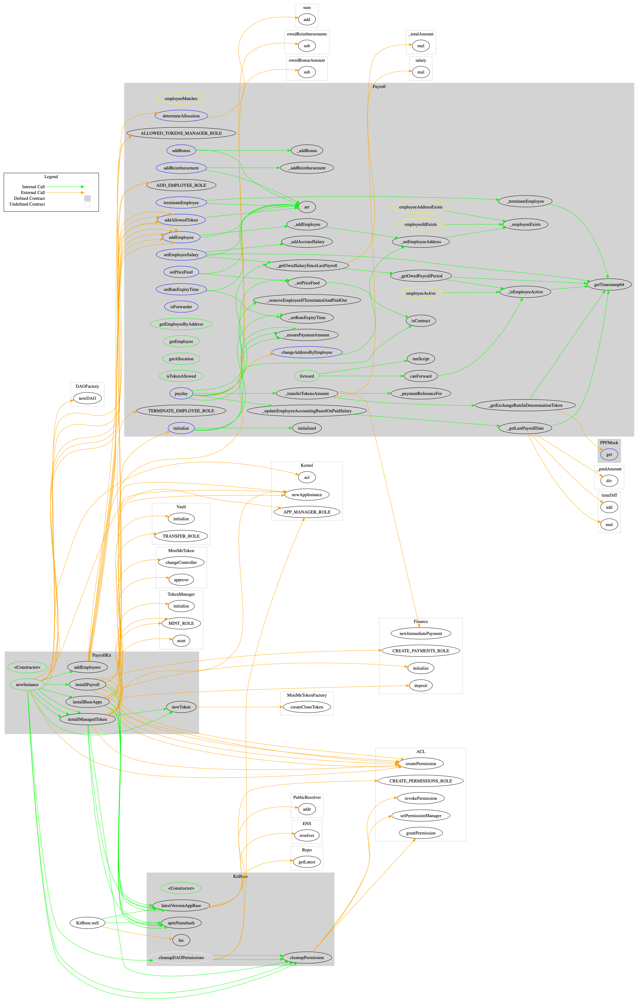

## Sūrya Call Graph

## Sūrya's Description Report

### Contracts Description Table

|  Contract  |         Type        |       Bases      |                  |                 |
|:----------:|:-------------------:|:----------------:|:----------------:|:---------------:|
|     └      |  **Function Name**  |  **Visibility**  |  **Mutability**  |  **Modifiers**  |
||||||
| **PPFMock** | Implementation | IFeed |||
| └ | get | External ❗️ |   |NO❗️ |
||||||
| **KitBase** | Implementation | APMNamehash, EVMScriptRegistryConstants |||
| └ | \<Constructor\> | Public ❗️ | 🛑  | |
| └ | latestVersionAppBase | Public ❗️ |   |NO❗️ |
| └ | cleanupDAOPermissions | Internal 🔒 | 🛑  | |
| └ | cleanupPermission | Internal 🔒 | 🛑  | |
||||||
| **PayrollKit** | Implementation | KitBase |||
| └ | \<Constructor\> | Public ❗️ | 🛑  | KitBase |
| └ | newInstance | Public ❗️ | 🛑  |NO❗️ |
| └ | installBaseApps | Internal 🔒 | 🛑  | |
| └ | installPayroll | Internal 🔒 | 🛑  | |
| └ | installManagedToken | Internal 🔒 | 🛑  | |
| └ | newToken | Internal 🔒 | 🛑  | |
| └ | addEmployees | Internal 🔒 | 🛑  | |
||||||
| **Payroll** | Implementation | EtherTokenConstant, IForwarder, IsContract, AragonApp |||
| └ | initialize | External ❗️ | 🛑  | onlyInit |
| └ | addAllowedToken | External ❗️ | 🛑  | authP |
| └ | setPriceFeed | External ❗️ | 🛑  | authP |
| └ | setRateExpiryTime | External ❗️ | 🛑  | authP |
| └ | addEmployee | External ❗️ | 🛑  | authP |
| └ | addBonus | External ❗️ | 🛑  | authP employeeActive |
| └ | addReimbursement | External ❗️ | 🛑  | authP employeeActive |
| └ | setEmployeeSalary | External ❗️ | 🛑  | authP employeeActive |
| └ | terminateEmployee | External ❗️ | 🛑  | authP employeeActive |
| └ | changeAddressByEmployee | External ❗️ | 🛑  | employeeMatches nonReentrant |
| └ | determineAllocation | External ❗️ | 🛑  | employeeMatches nonReentrant |
| └ | payday | External ❗️ | 🛑  | employeeMatches nonReentrant |
| └ | isForwarder | External ❗️ |   |NO❗️ |
| └ | forward | Public ❗️ | 🛑  |NO❗️ |
| └ | canForward | Public ❗️ |   |NO❗️ |
| └ | getEmployeeByAddress | Public ❗️ |   | employeeAddressExists |
| └ | getEmployee | Public ❗️ |   | employeeIdExists |
| └ | getAllocation | Public ❗️ |   | employeeIdExists |
| └ | isTokenAllowed | Public ❗️ |   | isInitialized |
| └ | _setPriceFeed | Internal 🔒 | 🛑  | |
| └ | _setRateExpiryTime | Internal 🔒 | 🛑  | |
| └ | _addEmployee | Internal 🔒 | 🛑  | |
| └ | _addBonus | Internal 🔒 | 🛑  | |
| └ | _addReimbursement | Internal 🔒 | 🛑  | |
| └ | _addAccruedSalary | Internal 🔒 | 🛑  | |
| └ | _setEmployeeAddress | Internal 🔒 | 🛑  | |
| └ | _terminateEmployee | Internal 🔒 | 🛑  | |
| └ | _transferTokensAmount | Internal 🔒 | 🛑  | |
| └ | _removeEmployeeIfTerminatedAndPaidOut | Internal 🔒 | 🛑  | |
| └ | _updateEmployeeAccountingBasedOnPaidSalary | Internal 🔒 | 🛑  | |
| └ | _employeeExists | Internal 🔒 |   | |
| └ | _employeeExists | Internal 🔒 |   | |
| └ | _isEmployeeActive | Internal 🔒 |   | |
| └ | _getExchangeRateInDenominationToken | Internal 🔒 |   | |
| └ | _getLastPayrollDate | Internal 🔒 |   | |
| └ | _getOwedSalarySinceLastPayroll | Internal 🔒 |   | |
| └ | _getOwedPayrollPeriod | Internal 🔒 |   | |
| └ | _paymentReferenceFor | Internal 🔒 |   | |
| └ | _ensurePaymentAmount | Private 🔐 |   | |
||||||
| **PPFFactory** | Implementation | IPPFFactory |||
| └ | newPPF | External ❗️ | 🛑  |NO❗️ |
||||||
| **PPF** | Implementation | IFeed, TimeHelpers |||
| └ | \<Constructor\> | Public ❗️ | 🛑  | |
| └ | update | Public ❗️ | 🛑  |NO❗️ |
| └ | updateMany | Public ❗️ | 🛑  |NO❗️ |
| └ | get | Public ❗️ |   |NO❗️ |
| └ | setOperator | External ❗️ | 🛑  |NO❗️ |
| └ | setOperatorOwner | External ❗️ | 🛑  |NO❗️ |
| └ | _setOperator | Internal 🔒 | 🛑  | |
| └ | _setOperatorOwner | Internal 🔒 | 🛑  | |
| └ | pairId | Internal 🔒 |   | |
| └ | pairXRT | Internal 🔒 |   | |
| └ | setHash | Internal 🔒 |   | |
| └ | isPairOrdered | Private 🔐 |   | |
||||||
| **IFeed** | Interface |  |||
| └ | get | External ❗️ |   |NO❗️ |
||||||
| **ECRecovery** | Library |  |||
| └ | personalRecover | Internal 🔒 |   | |
| └ | recover | Internal 🔒 |   | |
| └ | toEthSignedMessageHash | Internal 🔒 |   | |
||||||
| **IPPFFactory** | Interface |  |||
| └ | newPPF | External ❗️ | 🛑  |NO❗️ |

### Legend

|  Symbol  |  Meaning  |
|:--------:|-----------|
|    🛑    | Function can modify state |
|    💵    | Function is payable |

